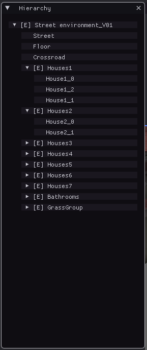
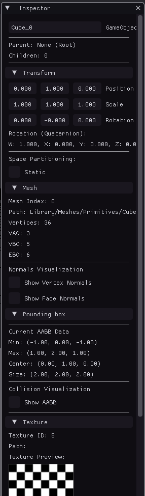
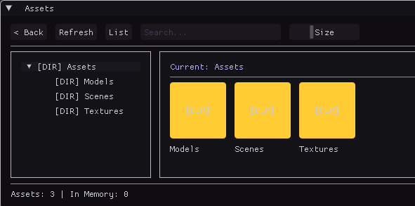
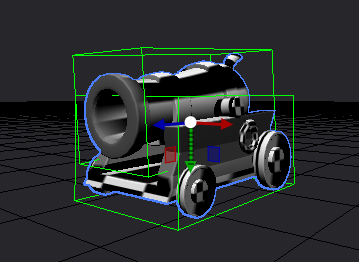
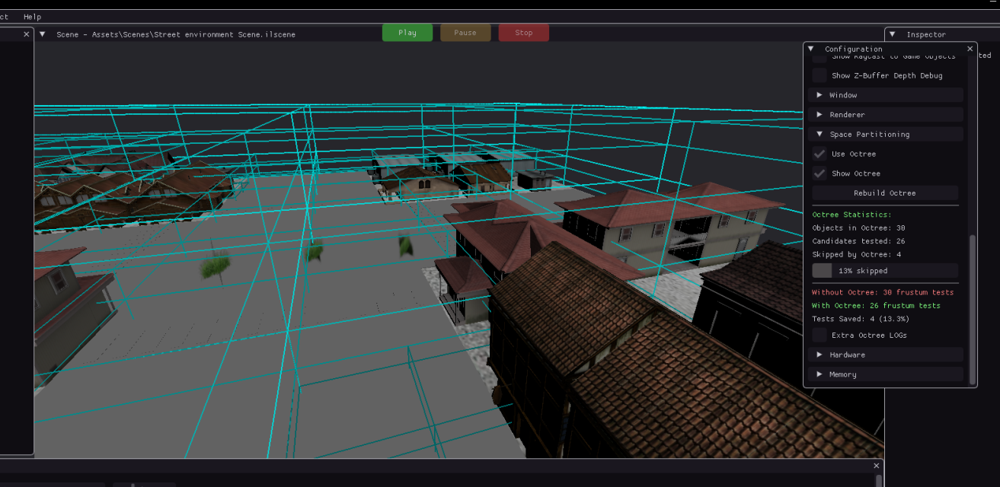

# 🎮 ILIUM ENGINE

🔗 **Repository:** https://github.com/bekun67/motor

Ilium Engine is a **video game engine** developed for the **Game Engines** course.

When the engine starts, it automatically initializes the base scene **StreetEnvironment.fbx**.  
If any texture is missing or cannot be found, the engine will apply a **checkerboard texture** as a fallback.

---

## 📸 Preview

> Main editor view with the base scene loaded.

---

## 👥 Team Members

- **Isaac Ramírez Prieto**  
  https://github.com/bekun67

- **Xavier Chaparro Foyo**  
  https://github.com/xavifast05

- **Clara Rodríguez Moreno**  
  https://github.com/kopeke4

---

## ✨ Features

### 🧭 Gizmo
Transform objects directly in the scene using an intuitive **gizmo** that appears when an object is selected.

---

### 🖱️ Mouse Picking
Objects can be selected simply by clicking on them.  
Mouse picking also allows **drag & drop** of objects and textures directly to the cursor position.

---

### 💾 Scene Serialization
The engine supports **scene serialization**, allowing the complete state of a scene to be saved and restored.

Scene serialization stores all relevant data required to recreate a scene, including:
- GameObjects hierarchy
- Transform data (position, rotation, scale)
- Mesh and texture references
- Static/Dynamic state
- Bounding box and rendering-related data

This system enables:
- Saving and loading scenes between engine sessions
- Preserving object relationships and hierarchies
- Iterating on levels without losing progress

By serializing scenes to disk, the engine ensures that the exact scene configuration can be reconstructed at any time, providing a foundation for future features such as scene editing, versioning, and level loading at runtime.

---

### ▶️ Play / ⏸️ Pause / ⏹️ Stop
- **Play:** Starts the scene while you can move objects, except for objects marked as *Static*.
- **Pause:** Pauses the scene.
- **Stop:** Resets all objects to their original positions.

---

### 🪟 ImGui Panels

#### 🌍 Scene
Main viewport displaying the loaded scene with all its objects and textures.

#### 🗂️ Hierarchy
Displays all **GameObjects** in the scene and allows selection.  
GameObjects can be parented to create **parent-child hierarchies**, allowing control of multiple objects at once.

#### 🖥️ Console
Displays log messages related to actions performed in the engine.

#### 🔍 Inspector
Displays the properties of the selected object:
- Name
- Transform (position, rotation, scale)
- Texture (change, replace, or apply checkerboard)
- Static flag
- Mesh information
- Normal visualization
- Bounding box information
- AABB visualization

When multiple GameObjects are selected, the Inspector adapts to show only shared editable properties.

#### 📦 Assets
Asset browser that displays the contents of the **assets folder**:
- Drag & drop assets into the scene
- Resize asset icons
- Search assets by name

---

### 📐 AABB (Frustum Culling)
Each GameObject has a **Bounding Box (AABB)** that can be visualized.  
This enables **frustum culling**, preventing objects outside the camera view from being rendered and improving performance.

---

### 🌳 Octree (Spatial Partitioning)
The **Octree** is a spatial data structure used to optimize scene performance.

**How it works:**
- Divides the 3D space into **eight recursive regions**
- Stores GameObjects inside nodes based on their position
- Quickly determines which objects are relevant for rendering or culling

**Benefits:**
- Improves frustum culling efficiency
- Reduces per-frame processing
- Enhances performance in complex scenes

The Octree works together with AABB culling to ensure that only visible objects are rendered.

---

## 🎮 Controls

### 🎥 Camera
- **Right Click:** Rotate camera  
- **W A S D + Right Click:** Move camera  
- **F:** Focus camera on geometry  
- **SHIFT:** Double movement speed  

---

### 📂 Load Models & Textures
- **Drag & Drop** files into the engine window

---

### 🧱 Object Transform
- **W:** Move  
- **E:** Rotate  
- **R:** Scale  

---

### ⌨️ Shortcuts
- **F1:** Previous object  
- **F2:** Next object
- **F3:** Deselect object  
- **F5:** Play  
- **F6:** Pause  
- **F7:** Stop
- **Save scene:** Ctrl + S
- **Save scene as...:** Ctrl + Shift + S
- **Import model:** Ctrl + I
- **Undo:** Ctrl + Z
- **Redo:** Ctrl + Y
- **Copy:** Ctrl + C
- **Paste:** Ctrl + V
- **Duplicate:** Ctrl + D
- **Delete:** Delete/Suprimir
- **Exit:** Alt + F4

---

## 🚧 Future Improvements
- Physics integration
