<h1 align="center">🌊 Wave Engine 🌊</h1>

This college project is a custom 3D game engine developed in C++ using OpenGL as the main graphics API.  
It integrates several external libraries such as Assimp (for 3D model loading), DevIL (for texture management), ImGui (for the user interface) and now Bullet (for physics management).

In version 3.0, a new team developed the entire physics system using Bullet for its logic, incorporating new components like Rigid Body for game objects, options to choose various colliders for game objects, options to select various constraints for game objects, and two components made exclusively to showcase the physics in-game: a component that lets you move the camera in-game that collides with other game objects and allows the player to shoot spheres, and a component that turns any game object into a car that you can control in-game. There are also two primitives connected by a distance constraint. Furthermore, you change base physics options in the settings window

🔗 <strong>GitHub Repository:</strong> <a href="https://github.com/Bekun67/Motor">https://github.com/Bekun67/Motor</a>

🔗 <strong>GitHub Release:</strong> <a href="https://github.com/Bekun67/Motor/releases">https://github.com/Bekun67/Motor/releases</a>

---

## 📸 Physics Preview

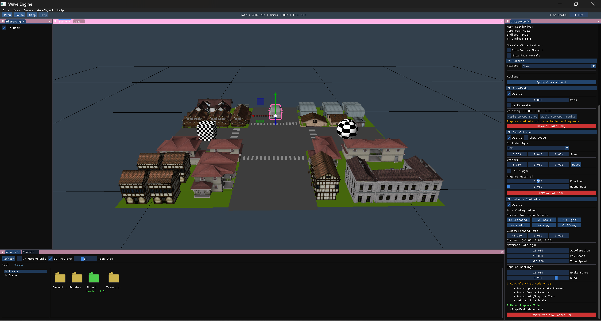

> Main editor view with the base scene loaded showcasing physics.

---

## 🔥 New Physics System Team Members

- **Xavier Chaparro** — [GitHub: XaviFast05](https://github.com/XaviFast05)  
- **Clara Rodriguez** — [GitHub: Kopeke4](https://github.com/Kopeke4)
- **Isaac Ramirez** — [GitHub: Bekun67](https://github.com/Bekun67)
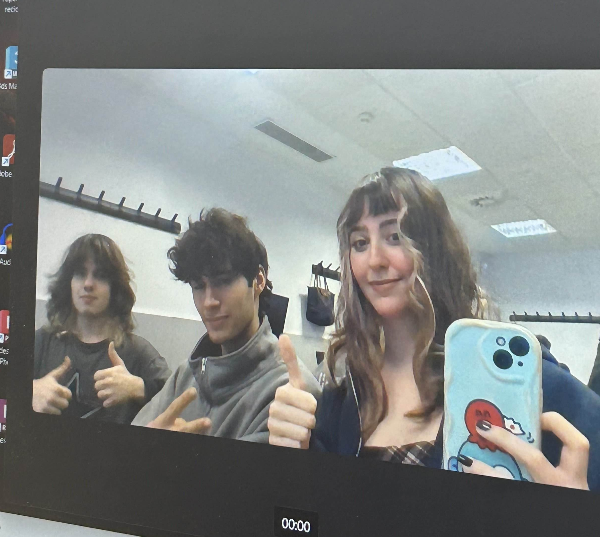
---

## 🎏 Original Wave Engine Team Members

- **Haosheng Li** — [GitHub: HaosLii](https://github.com/HaosLii)  
- **Ana Alcaraz** — [GitHub: Audra0000](https://github.com/Audra0000)

---
## 🦀 Controls in Game to showcase physics

- Camera actions (PLEASE NOTE: Movement while looking around is not possible, you can just use WASD or Look Around one at the same time)

| Action | Key 1 | Key 2 |
|------------|------------|------------|
| Up | Space | |
| Down | Left Ctrl | |
| Forward, backwards, left, right | WASD | |
| Look around | Right mouse button and move mouse | |
| Shoot Sphere | Left mouse button | |

- Car actions (PLEASE NOTE: Car is independent from camera, so you can move both when you want)

| Action | Key 1 | Key 2 |
|------------|------------|------------|
| Forward | Up arrow | |
| Backwards | Left Arrow | |
| Turn left and right | Left and Right arrow | |
| Brake | Left shift | |

---

## 🦀 Controls in scene

| Action | Key 1 | Key 2 |
|------------|------------|------------|
| Up | Space | |
| Down | Left Ctrl | |
| Zoom | Mouse wheel | |
| Velocity ×2 | Hold Shift | |
| Free movement | Right Mouse Button | WASD |
| Orbit | Left Alt | Left Mouse Button |
| Focus | F | |
| Select | Left Mouse Button | |
| Multiple select | Shift | Left Mouse Button |
| Delete object | Backspace | |

| Gizmo Action | Key 1 | Key 2 |
|------------|------------|------------|
| Move | W | |
| Rotate | E | |
| Scale | R | |
| Toggle Coordinate System | T | |
---

## ✨🧱 Physics system 
With the help of Bullet, we implemented a physics system in Wave Engine, and it can do the following:

- Ability to change gravity and simulation in Settings:  
  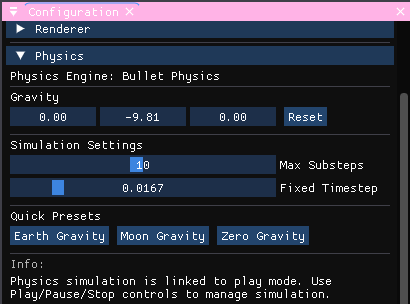
- Component Rigid Body that you can attach to a Game Object:  
  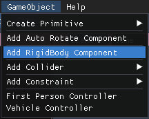
  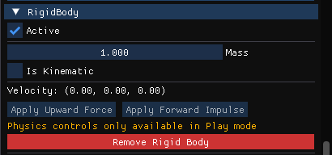
- Component Collider that you can attach to a Game Object:  
  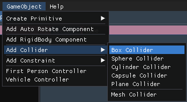
  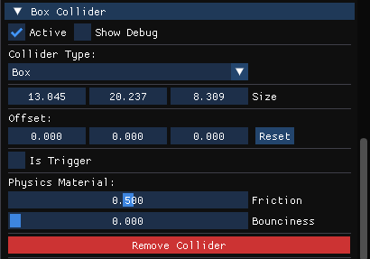
  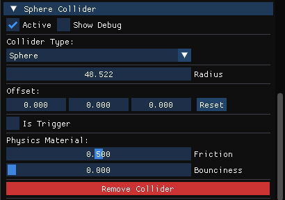
  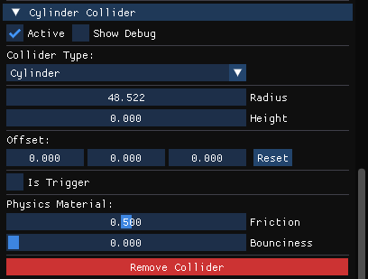
  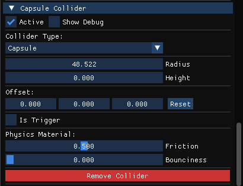
  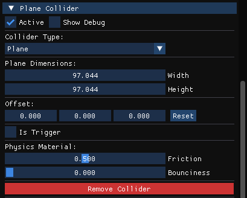
  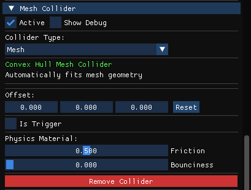
  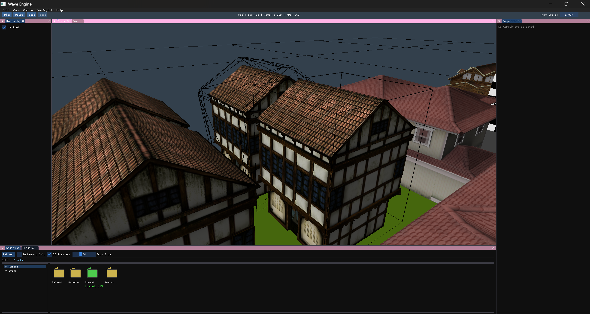
- Component Constraint that you can attach to a Game Object:  
  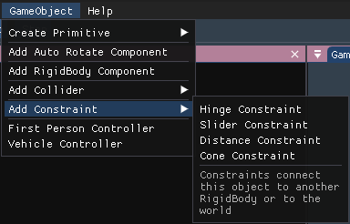
  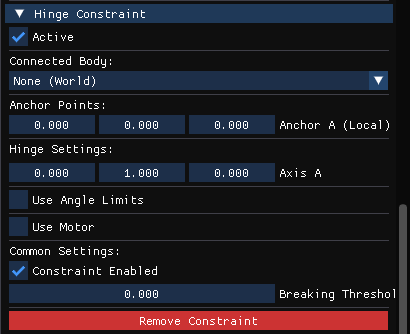
  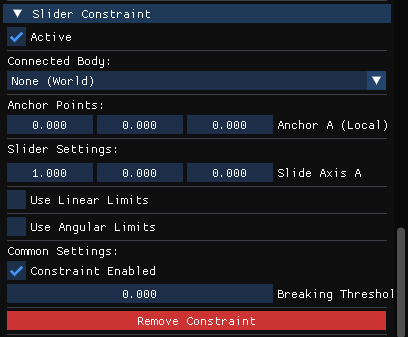
  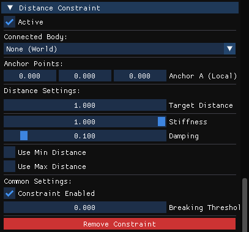
  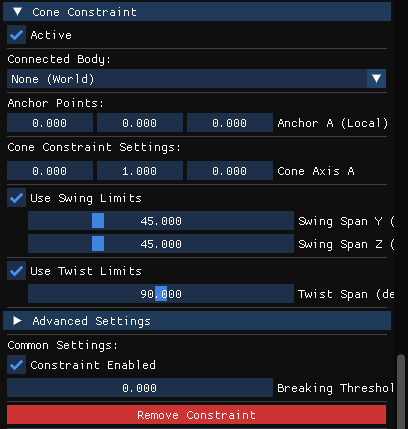
- Component First Person Controller for Demo purposes that you can attach to a Camera. Allows you to move the game camera freely, collide with other game objects and shoot spheres to interact with the scene:  
  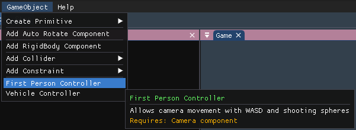
  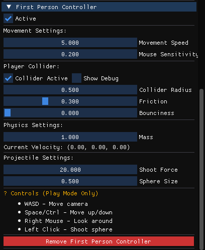
- Component Vehicle for Demo purposes that you can attach to a Game Object . Allows you to move the game object like a car, having realistic physics if you also attach a rigid body and a collider to the same game object:  
  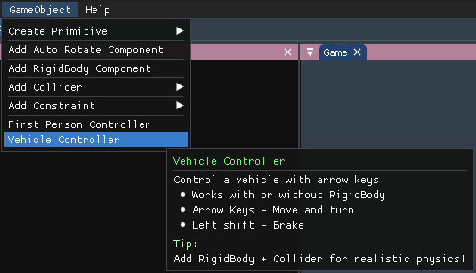
  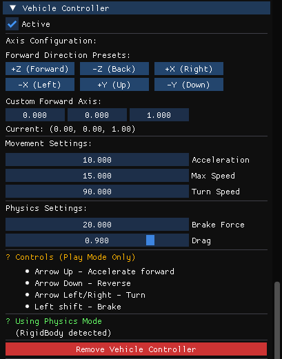

## 💥 Scene With Physics 

  
  

---
## 🐠 User Interface

### **Console**
The console logs all engine events and processes, such as:
- Loading geometry (via **ASSIMP**)
- Loading textures (via **DevIL**)
- Resource management operations
- Initialization of external libraries
- Application flow and error messages

Additionally, it includes several **interactive options**:
- **Clear:** Erases all current console messages  
- **Log filters:** Enable or disable the display of specific types of logs (info, warnings, errors)

---

### **Configuration**
This window is divided into **five tabs**:

1. **FPS:** Displays the current frame rate and performance data.  
2. **Window:** Allows full customization of the application window:  
   - Adjust size and resolution  
   - Toggle **fullscreen** or **borderless** mode  
   - Enable/disable **resizable** window  
3. **Camera:**  
   - Adjust camera settings 
   - Reset camera settings  
   - View current **camera position**
   - Displays a summary of **camera controls**
   - Change current active camera
   - Displays current active camera
4. **Renderer:**  
   - Enable or disable **face culling** and choose its mode  
   - Toggle **wireframe mode**  
   - Change the **background color** of the scene
   - Toggle debug visualization for AABBs, octree,raycast, zBuffer
5. **Physics:**
   - Change gravity and the direction of it
   - Simulation settings for max substeps and fixed timestep
   - Quick pressets for Earth gravity, Moon Gravity and Zero gravity
6. **Hardware:**  
   - Displays detailed information about the system hardware in use  

---

### **Assets Window**
A dedicated panel to manage all project resources:
- Browse assets organized
- Import new assets via drag-and-drop
- Delete assets (automatically removes associated files in Library folder)
- Visualize reference
- View asset and import settings

---

### **Hierarchy**
Displays all GameObjects in the current scene, allowing:
- Selection of scene objects
- Reparenting objects (drag to change hierarchy)
- Renaming (double click)

---

### **Inspector**
Provides detailed information and transformation options for the selected GameObject:
- **Gameobject:**
   - Set active camera (only camera)
   - Reparenting objects (list)
   - Creating empty GameObjects
   - Deleting objects
- **Gizmo:**
   - Change gizmo mode
   - World/Local 
- **Transform:** Modify **position**, **rotation**, and **scale** directly.  
  Includes a **reset option** to restore default values.  
- **Mesh:**  
  - Displays mesh data and allows **normal visualization** (per-triangle / per-face)  
  - Select any imported mesh from the Assets window   
- **Material:**  
  - Shows texture path and dimensions  
  - Preview textures with optional checker pattern  
  - Select textures from the Assets window  
- **Camera Component** (when selected):  
  - Active frustum culling
  - Toggle debug visualization for frustum culling

---

### **Toolbar**

Includes the following menu options:

- **File:**
  - Save scene
  - Load scene 
  - Exit the program  
- **View:** Show or hide any of the editor windows
  - Layout (Save, load, auto save)  
- **Cameras:**  
  - Create camera
- **Gameobjects:**
  - Create primitves
  - Add rotate component
  - Add Rigid Body component
  - Add Collider component
    - Box Collider
    - Sphere Collider
    - Cylinder Collider
    - Capsule Collider
    - Plane Collider
    - Mesh Collider
  - Add Constraint
    - Hinge Constraint
    - Slider Constraint
    - Distance Constraint
    - Cone Constraint
  - Add First Person Controller (For demo purposes)
  - Add Vehicle Controller (For demo purposes)
- **Help:**
  - *GitHub documentation:* Opens the official documentation  
  - *Report a bug:* Opens `[Link to repo]/issues`  
  - *Download latest:* Opens `[Link to repo]/releases`  
  - *About:* Displays engine name, version, authors, libraries used, and MIT License  

---

## ✨ Extra features 
- **Transparent textures**
- **zBuffer**
- **Assets icons**
- **Asset Deletion:** Delete assets directly from the explorer with automatic cleanup of associated Library files
- **Import Settings:** Basic implementation of import options for different asset types:
  - **Textures:** Control filtering modes, max texture size, and flip options (X/Y axes)
  - **Meshes:** Configure global scaling, axis configuration, Post-processing options: generate normals, flip uv, optimize meshes
  - **Metadata:** All import settings are saved in .meta files to ensure proper regeneration of the Library folder

---

## ✨ New Core Features 

### **Resource Management System**
- Complete asset pipeline with automatic conversion to custom file formats
- Assets stored in a structured "Assets" folder, with optimized versions cached in "Library"
- Reference counting ensures resources are loaded only once regardless of usage count
- Automatic regeneration of Library folder from Assets and metadata files
- Support for importing new assets at runtime

### **Performance Optimizations**
- **Frustum Culling:** Objects outside the camera view are not rendered
- **Octree Spatial Partitioning:** Accelerates both rendering culling and object selection
- **Debug Visualizations:** Toggle visual representations of AABBs, octree nodes, and frustum

### **Scene Management**
- Scene serialization to custom file format
- Automatic loading of default scene ("StreetEnvironment")
- Complete GameObject hierarchy support with parent-child relationships
- Runtime transformation of objects (position, rotation, scale)

### **Camera System**
- Configurable camera component with adjustable parameters
- Selection system using raycasting with octree
- Visual feedback for selection operations

### **Custom File Formats**
- Proprietary formats for models, textures and scenes
- Metadata files storing import settings and dependencies

---

© 2025 Wave Engine Physics System — Developed by Xavier Chaparro, Isaac Ramirez & Clara Rodriguez — MIT License

